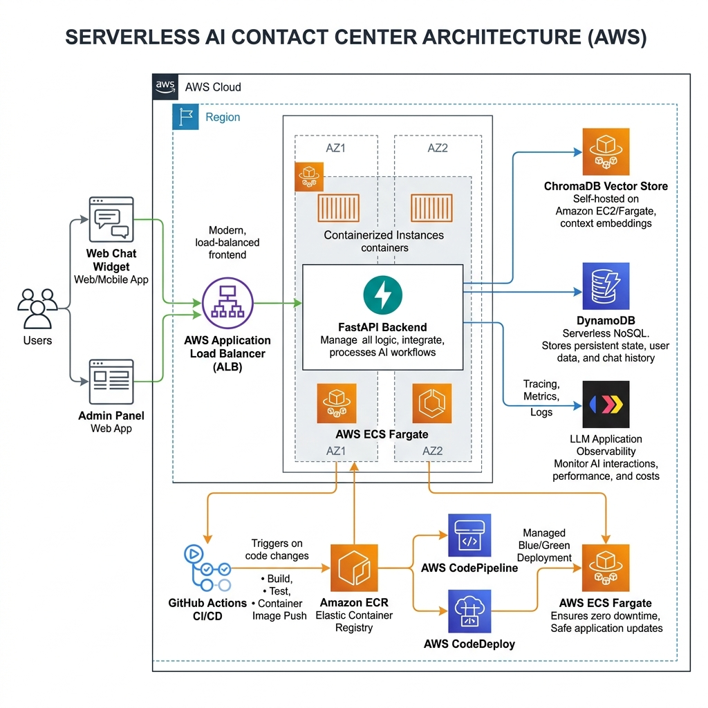
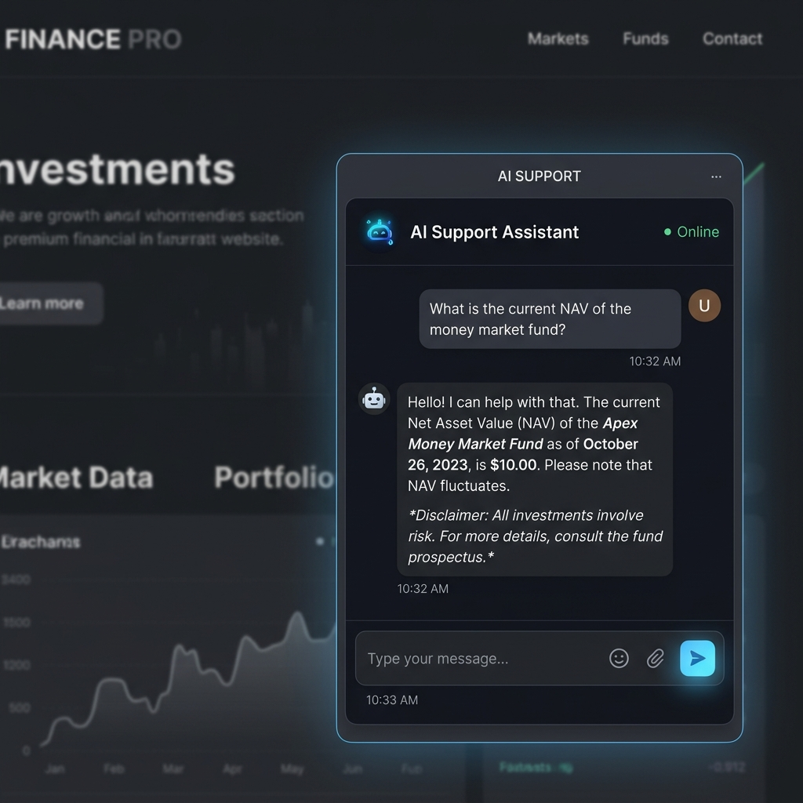
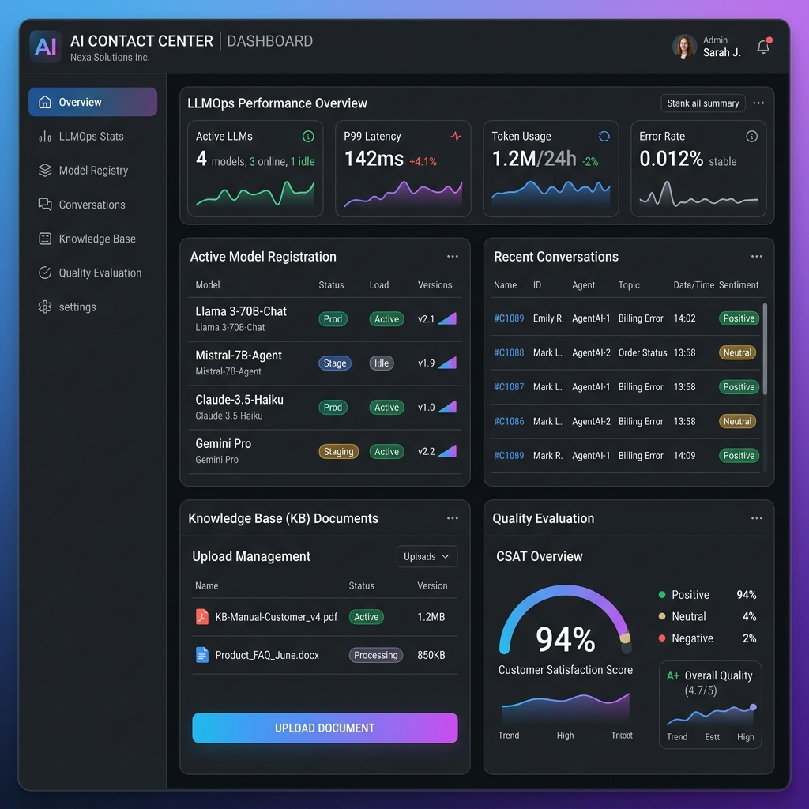

# AI Contact Center Starter Kit

> A production-grade, reusable open-source template for building AI-powered contact center systems using **FastAPI**, **OpenAI tool calling**, **RAG**, **live data tools**, **LLM observability**, **Docker**, **Terraform**, and **AWS deployment**.

[](LICENSE)
[](https://python.org)
[](https://fastapi.tiangolo.com)
[](https://terraform.io)
[](https://github.com/saademad200/AI-Contact-Center/actions)

---

## What Is This?

This starter kit gives you a **complete, deployable AI contact center backend** out of the box. Fork it, configure your domain and data sources, and ship a production-ready AI support agent — without building the scaffolding from scratch.

It is designed to be **domain-agnostic**: the financial services example (mutual fund NAVs, fund performance, investment advice) shows how the pattern works, but the same architecture applies to **e-commerce**, **SaaS support**, **healthcare portals**, **government services**, or any other vertical where you need an AI agent that calls live APIs, searches a knowledge base, and escalates to humans.

---

## Who This Helps

| Persona | How this kit helps |
|---------|-------------------|
| **Indie developers** | Skip 2–3 months of infrastructure boilerplate. Fork, configure, deploy. |
| **Startups** | Production-grade AWS stack (ECS Fargate, CodeDeploy Blue/Green, Secrets Manager) without a DevOps hire. |
| **Enterprise teams** | Reference architecture for RAG + tool calling + observability. Adapt the Terraform modules to your VPC. |
| **AI/ML engineers** | Working LLM orchestration loop, fine-tuning pipeline, and Langfuse tracing ready to extend. |
| **Financial services** | Compliant-first design: no hardcoded secrets, SAST in pre-commit, audit trail in DynamoDB. |
| **Open-source contributors** | Well-documented modules, ADRs, and a public roadmap with `good first issue` labels. |

---

## Architecture



```
┌─────────────────────────────────────────────────────────────┐
│                        Frontend                             │
│   Vanilla JS chat widget  │  Jinja2 Admin Dashboard SPA    │
│   (embeddable <script>)   │  (LLMOps, conversations, eval) │
└────────────────┬──────────────────────────┬─────────────────┘
                 │ WebSocket                │ REST API
┌────────────────▼──────────────────────────▼─────────────────┐
│                    FastAPI Backend                           │
│  ┌─────────────┐  ┌──────────────┐  ┌───────────────────┐  │
│  │  AI Agent   │  │   Routers    │  │    Services        │  │
│  │ Orchestrator│  │ /api/v1/*    │  │ Embeddings, Email  │  │
│  │ Tool Calling│  │ /ws/chat/:id │  │ Fine-Tuning, Vector│  │
│  └──────┬──────┘  └──────────────┘  └───────────────────┘  │
│         │ Tools                                              │
│  ┌──────▼──────────────────────────────────────────────┐    │
│  │              Tool Registry                          │    │
│  │  get_nav │ get_performance │ search_kb │ recommend  │    │
│  │  project │ calculate │ list_funds │ escalate_human  │    │
│  └──────┬──────────────┬──────────────────────────────-┘    │
└─────────┼──────────────┼────────────────────────────────────┘
          │              │
┌─────────▼───┐  ┌───────▼──────────┐  ┌────────────────────┐
│  Live Data  │  │   ChromaDB RAG   │  │     DynamoDB       │
│  Scrapers   │  │  PDF / Doc Store │  │  Conversations,    │
│ (httpx+BS4) │  │  (embeddings)    │  │  Messages, Ratings │
└─────────────┘  └──────────────────┘  └────────────────────┘
          │
┌─────────▼─────────────────────────────────────────────────┐
│                   AWS Infrastructure                       │
│  ECS Fargate  │  CodeDeploy B/G  │  Secrets Manager       │
│  ECR          │  S3 + Lambda     │  SES (escalation email)│
│  GitHub Actions OIDC CI/CD  │  Terraform modules          │
└───────────────────────────────────────────────────────────┘
```

---

## Screenshots

### Web Chat Widget


### LLMOps & Admin Dashboard


---

## Stack

| Layer | Technology |
|-------|-----------|
| **API + Agent** | FastAPI, WebSockets, OpenAI tool calling |
| **LLM** | OpenAI `gpt-4o-mini` (swappable) |
| **Observability** | Langfuse (traces, evals, prompt management) |
| **RAG** | ChromaDB + `sentence-transformers/all-MiniLM-L6-v2` |
| **Fine-Tuning Pipeline** | AWS S3 → Lambda → OpenAI Fine-Tuning Jobs |
| **Database** | AWS DynamoDB (conversations, messages, ratings) |
| **Frontend** | Vanilla JS embeddable widget + Jinja2 admin SPA |
| **Infrastructure** | Terraform (modular: VPC, ECS, ECR, IAM, S3, Lambda, CodeDeploy) |
| **Deployment** | AWS ECS Fargate + CodeDeploy Blue/Green (zero downtime) |
| **CI/CD** | GitHub Actions with OIDC (no static AWS keys) |
| **Secrets** | AWS Secrets Manager |
| **Code Quality** | ruff, black, mypy, bandit, semgrep, detect-secrets |

---

## Quick Start

### Local Development

```bash
# 1. Clone and configure
git clone https://github.com/saademad200/AI-Contact-Center.git
cd AI-Contact-Center
cp .env.example .env
# Edit .env: set OPENAI_API_KEY, LANGFUSE keys, etc.

# 2. Start all services (API + DynamoDB local + ChromaDB)
make dev

# Endpoints:
# API:          http://localhost:8000
# API Docs:     http://localhost:8000/docs
# Admin Panel:  http://localhost:8000/admin
# Chat Widget:  http://localhost:8000/static/widget.js
# Demo Page:    http://localhost:8000/demo
# Health:       http://localhost:8000/health

# 3. Create DynamoDB tables and seed knowledge base
make tables
make seed
make ingest

# 4. Run tests and linting
make test-unit
make lint
```

### Docker

```bash
docker compose up --build
```

### AWS Deployment

```bash
# Provision infrastructure (staging)
cd infrastructure/terraform/environments/staging
terraform init && terraform apply

# Deploy via GitHub Actions (see .github/workflows/)
git push origin main   # triggers CI → ECR build → CodeDeploy Blue/Green
```

---

## Agent Tools

The agent uses **OpenAI tool calling** to invoke the right function based on user intent. All tools are registered in `backend/app/agent/tool_registry.py` and easy to extend.

| Tool | Purpose |
|------|---------|
| `search_knowledge_base` | RAG search over PDFs, docs, regulations |
| `get_fund_nav` | Live data fetch: current asset prices |
| `get_fund_performance` | Live data fetch: return metrics |
| `list_funds` | Catalogue browse with filters |
| `recommend_funds` | Goal/risk-based recommendation engine |
| `project_investment` | Compound growth projection calculator |
| `calculate_historical_value` | Historical investment value calculator |
| `escalate_to_human` | Create support ticket → SES email → DynamoDB log |

> **Adapting to your domain:** Replace `get_fund_nav` / `get_fund_performance` with your own live data sources (REST APIs, databases, scrapers). The orchestrator loop, tool registry pattern, and WebSocket protocol are domain-agnostic.

---

## Maintainer Workload

This project is actively maintained. Weekly workload includes:

| Activity | Time/week |
|----------|-----------|
| Issue triage & labeling | ~1–2 hrs |
| PR review (code + tests) | ~2–3 hrs |
| Security scanning (bandit, semgrep, detect-secrets) | ~1 hr (automated, review results) |
| Dependency updates (dependabot / manual) | ~1 hr |
| Documentation & ADR updates | ~1 hr |
| AWS infrastructure monitoring & cost review | ~1 hr |
| Eval dataset expansion + Langfuse review | ~1 hr |

The security posture is a first-class concern: SAST runs on every commit via pre-commit hooks (bandit + semgrep), secrets scanning blocks commits with credentials, and all AWS access uses short-lived OIDC tokens.

---

## Documentation

| Document | Description |
|----------|-------------|
| [`docs/ARCHITECTURE_DECISIONS.md`](docs/ARCHITECTURE_DECISIONS.md) | Architecture Decision Records (ADRs) — the *why* behind every major choice |
| [`docs/DATA_GATHERING_GUIDE.md`](docs/DATA_GATHERING_GUIDE.md) | How to populate the knowledge base with your domain's data |
| [`docs/INFRASTRUCTURE_CHECKLIST.md`](docs/INFRASTRUCTURE_CHECKLIST.md) | Step-by-step AWS deployment checklist |
| [`docs/GITFLOW.md`](docs/GITFLOW.md) | Branching strategy and release process |
| [`ROADMAP.md`](ROADMAP.md) | Public roadmap — what's coming next |
| [`CONTRIBUTING.md`](CONTRIBUTING.md) | How to contribute |
| [`SECURITY.md`](SECURITY.md) | Security policy and vulnerability reporting |

---

## Roadmap

See [`ROADMAP.md`](ROADMAP.md) for the full public roadmap.

**Next milestone (v0.2.0):** Multi-tenant support, streaming responses, OpenAI Assistants API adapter.

---

## Contributing

Contributions are welcome! See [`CONTRIBUTING.md`](CONTRIBUTING.md) for guidelines.

Good places to start:
- Issues labeled [`good first issue`](https://github.com/saademad200/AI-Contact-Center/issues?q=label%3A%22good+first+issue%22)
- Issues labeled [`documentation`](https://github.com/saademad200/AI-Contact-Center/issues?q=label%3Adocumentation)

---

## License

MIT — see [`LICENSE`](LICENSE).

---

## Security

See [`SECURITY.md`](SECURITY.md) for the vulnerability reporting policy. Please do **not** open public issues for security vulnerabilities.
