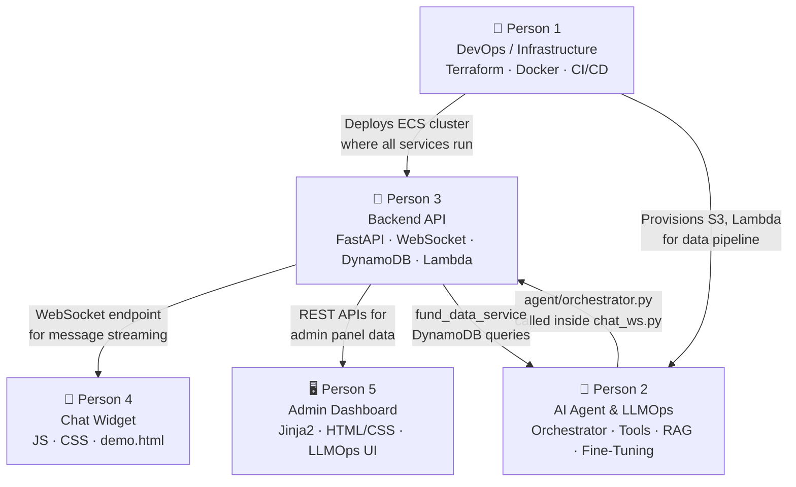

# Task Distribution

> **Project:** Alfalah Investments AI Contact Center
> **Reference:** [`PROJECT_PLAN.md`](PROJECT_PLAN.md)
> **Updated Scope:** OpenAI Fine-Tuning, AWS CodeDeploy (Blue/Green), AWS Secrets Manager, S3+Lambda Pipeline, Langfuse, Live Web Scraping.

---

## Person 1 — DevOps / Infrastructure
**Focus:** AWS ECS, CodeDeploy, Terraform, CI/CD, Docker, Code Quality Tooling

| Task | Priority |
|------|----------|
| Write all Terraform modules (`vpc`, `ecs`, `code_deploy`, `dynamodb`, `s3`, `lambda`, `iam`, `sns`) | P0 |
| Configure S3 remote state and DynamoDB state locking | P0 |
| Create `staging/` and `prod/` environment configs with separate `.tfvars` | P0 |
| Write multi-stage `Dockerfile` (Python 3.11-slim) for the backend API | P0 |
| Implement GitHub Actions workflow (`deploy.yml`) utilizing AWS CodeDeploy Blue/Green | P0 |
| Configure `appspec.yaml` and `taskdef.json` for ECS Blue/Green Deployments | P0 |
| Configure GitHub Actions to use GitHub OIDC (`role-to-assume`) instead of static AWS keys | P0 |
| Configure IAM to allow ECS Execution Role to fetch from AWS Secrets Manager | P0 |
| Set up `.pre-commit-config.yaml` (`ruff`, `black`, `mypy`, `bandit`, `semgrep`, `detect-secrets`) | P0 |
| Write `docker-compose.yml` for local dev (api + chromadb + dynamodb-local) | P0 |
| Write `Makefile` with dev shortcuts (`make dev`, `make test`, `make lint`) | P1 |
| Configure AWS SES for email notifications and verify sender domain | P1 |

---

## Person 2 — AI Agent & LLMOps
**Focus:** OpenAI Tool Calling, Langfuse, Live Web Scraping, RAG Pipeline

| Task | Priority |
|------|----------|
| Implement `agent/orchestrator.py` — main agent loop (receive → LLM → tool call → respond) | P0 |
| Implement `agent/tool_registry.py` — map python functions to OpenAI JSON schemas | P0 |
| Implement `agent/tools/get_fund_nav.py` — live web scraping of Alfalah/MUFAP using `BeautifulSoup4` | P0 |
| Implement `agent/tools/get_fund_performance.py` — live web scraping for fund returns | P0 |
| Implement `agent/tools/search_kb.py` — RAG search tool querying ChromaDB | P0 |
| Wrap the OpenAI client with Langfuse to enable detailed tracing and evaluations | P0 |
| Fetch the active model ID and system prompt dynamically from DynamoDB registries for each chat | P0 |
| Implement PDF parsers and `sentence-transformers` embedding logic for the RAG pipeline | P0 |
| Implement `services/finetuning_service.py` to trigger the OpenAI `fine_tuning.jobs.create` API | P1 |
| Write unit tests for all scraping tools, embedding logic, and prompt schemas | P1 |

---

## Person 3 — Backend API & Data Pipelines
**Focus:** FastAPI, WebSockets, Lambda Preprocessing, Admin APIs

| Task | Priority |
|------|----------|
| Set up `main.py` — FastAPI application with CORS, logging, and error handlers | P0 |
| Implement `routers/chat_ws.py` — WebSocket endpoint to receive msgs, save to Dynamo, and stream responses | P0 |
| Implement `core/dynamo.py` — schemas for Prompt Registry, Model Registry, Conversations, and Messages | P0 |
| Implement AWS Lambda script (`lambda_processor/main.py`) to trigger on S3, clean text, and format to JSONL | P0 |
| Implement `routers/documents.py` — document upload API with toggle logic (route to RAG ChromaDB vs Fine-Tuning S3) | P0 |
| Implement `routers/llmops.py` — Admin APIs to CRUD prompt versions, check FT status, and trigger training | P0 |
| Implement `services/storage_service.py` — boto3 logic for S3 file uploads/downloads | P0 |
| Write API integration tests for WebSocket stability and REST endpoints | P1 |

---

## Person 4 — Frontend Chat Widget
**Focus:** Embeddable JS Chat Widget & Demo Page

| Task | Priority |
|------|----------|
| Build `widget.js` — self-contained script, WebSocket client, and message rendering | P0 |
| Build `widget.css` — chat bubble styles, responsive design, Alfalah branding | P0 |
| Build `demo.html` — mock Alfalah landing page with the widget embedded | P0 |
| Implement tool call indicators (e.g. "🔍 Scraping live NAV..." while waiting for tool response) | P1 |
| Implement connection handling: auto-reconnect, offline state, and typing indicators | P1 |
| Implement session persistence utilizing `sessionStorage` for `conversationId` | P2 |

---

## Person 5 — Admin Dashboard UI
**Focus:** Jinja2 Templates, LLMOps Dashboard

| Task | Priority |
|------|----------|
| Create `base.html`, `login.html`, and `dashboard.html` using Jinja2 and Tailwind/Bootstrap | P0 |
| Create `llmops.html` — UI for viewing Prompt/Model Registries, selecting active models, and triggering FT | P0 |
| Create `knowledge_base.html` — UI with file upload form and a toggle switch (RAG vs Training Data) | P0 |
| Create `conversations.html` and `conversation_detail.html` to view past chat transcripts | P1 |
| Write custom CSS (`admin.css`) and JS for forms, modals, and DataTables | P1 |
| Implement FastAPI views (`admin/views.py`) returning `TemplateResponse` for all admin pages | P1 |

---

## Dependency Graph

### Who Can Start Without Waiting?
| Person | Can Start Immediately? | Blocked On |
|--------|----------------------|------------|
| P1 (Infra) | ✅ Yes | — |
| P2 (AI) | ✅ Yes | Can mock DynamoDB and use local ChromaDB |
| P3 (Backend) | ✅ Yes | — |
| P4 (Widget) | ✅ Yes | Can use a local mock WebSocket server |
| P5 (Admin) | ✅ Yes | Can build static HTML/CSS immediately |

### Integration Checkpoints
| Checkpoint | Who | When |
|-----------|-----|------|
| P3's WebSocket endpoint working | P3 → P4 can connect real widget | Day 2 end |
| P2's orchestrator importable | P3 can wire `chat_ws.py` → agent | Day 2 end |
| P1's staging Terraform applied | Everyone can test on AWS | Day 3 |
| P3's admin REST APIs ready | P5 can wire live data to templates | Day 4 |
